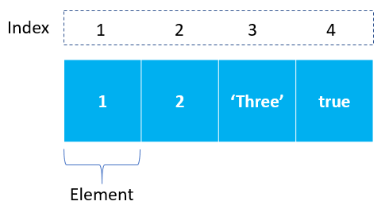

# Array Basics





#### Arrays

An array is a special variable, which can hold more than one value at a time. If you have a list of items (a list of anime series, for example), storing the animes in single variables could look like this:

```
const anime1 = `One Piece`;
const anime2 = `Steins;Gate`;
const anime3 = `Berserk`;
```

_However, what if you want to loop through the animes and find a specific one? And what if you had not 3 animes, but 300? The solution is an array! An array can hold many values under a single name, and you can access the values by referring to an index number._

```
const animes = [`One Piece`, `Steins;Gate`, `Berserk`];
```

You access an array element by referring to the index number.This statement accesses the value of the first element in animes:

**Note: Array indexes start with 0. \[0] is the first element. \[1] is the second element.**

```
const name1 = animes[0]; // One Piece
const name2 = animes[1]; // Steins;Gate
const name3 = animes[2]; // Berserk
```

The length property of an array returns the length of an array (the number of array elements).

```
const fruits = [`Banana`, `Orange`, `Apple`, `Kiwi`];
fruits.length; // the length of fruits is 4
```

### For Loop

Let’s start with the most common and the oldest loop, the For Loop. This is what it looks like:


You can see in the above that between the brackets there are three required attributes, these are:

- L<mark style="color:blue;">et i = 0; – This creates a new variable that we increment on every loop. “i” represents the Index and we use this variable to access the emoji in the array.</mark>
- <mark style="color:purple;">i < emojis.length; – This is a conditional statement. This code tells the engine to keep looping as long as “i” is less than the Array size.</mark>
- <mark style="color:orange;">i++; – This last attribute is shorthand to increment i. It is the same as writing i = i+1. It will add 1 to “i” on every loop.</mark>

In our example, the above loop will loop through each emoji and then print the emoji to the console:

- c<mark style="color:red;">onsole.log(emojis\[i]) – console.log is how we print to the console. To access each emoji we need to pass the index inside the square brackets.</mark>

If you run this code, you will get an output like this:


This basic For loop will run anywhere you can execute JavaScript. You can always rely on this to be available in any browser.

Sometimes you need to loop until you find an element in the Array. To do this we can use a Break statement.

#### Break

Break will stop the For loop from running. This is useful when you are trying to find a value in a large Array. For example, say that we were not sure where the skull was in our Array and we wanted to loop until we found it.&#x20;

Well, we could write code like this:


As soon as we match the skull the loop stops. Can you guess what the console output will be? Here it is:


What if we wanted to perform an operation on all the values in the Array except one? In this case, we could use Continue.

#### Continue

Continue is like a Break statement but instead of stopping the loop it can skip or “jump over” an item in the array.&#x20;

This time we are going to write the code so that when we find a skull, we skip it and we won’t print it to the console:


As you can see, the code is almost the same as the prior example, except that this time we have replaced Break with Continue. The outcome is different:


The skull has not been printed as expected. You can use Continue to filter an Array and only perform an operation on some of the items.

### For..In

We have looked at traditional For loops, but there are shorter versions. We can use a For..in loop to loop through an Array like this:


This is shorter code and there is no need to increment the index using the i++ code. So why not use this loop all the time?

There is a problem with For..in.

You see, it is possible to extend a built-in object like Array. For example, I can create a custom operation on an Array, like this:


Now when you run the code this is the output:


The \`foo\` function is part of the loop! For this reason, you should **never **use For..in in your code.

We have discussed the basic For loops—next, we will look at While loops.

### While Loop

A While Loop will continue to loop while a condition is true.&#x20;

For example, the below code will loop while “i” is less than the Array size:


We are doing the same thing as we were in the For loop:

- i = 0 – Creating an index variable and setting it to 0.
- i < emojis.length – Looping while i is less than emojis.length
- console.log(emojis\[i]) – printing each emoji String to the console.
- i++ – Incrementing the index by 1 on each loop.

This code will print all the emojis.&#x20;

Why would you use a While loop over a For loop?

Although they are interchangeable, you will not see While loops very often in JavaScript code. But, they can be useful. For example, say we are not sure what position the fox emoji is in. We want to loop until we see a fox. This is what the code will look like:


For each loop, we check the condition (noFox) and if it is ‘true,’ then the loop continues. As soon as ‘noFox’ is set to false the loop will stop. This is like the break statement For loop we used above.&#x20;

What if you wanted to check the conditional after the loop? Well, in that case, you need a Do/While loop.

### Do/While Loop

This loop is almost identical to the while loop, except the condition check is at the end. This is what the code will look like:


The code will run in this flow:

- Set the index to 0
- Print the first element in the Array using console.log
- Add 1 to the index
- Then check is index is still less than the size of the Array

### ES5

All the loops we have discussed so far are available in any JavaScript environment. If you are doing [front-end development](https://teamtreehouse.com/techdegree/front-end-web-development), then you need to think about browser support. Over the last few years, there have been many advances in the JavaScript language. There are new loops available.

The first changes came in ES5, which means version 5 of JavaScript. The new loops are:

- forEach
- map

For both of these are operations, you can call on an Array. For the emojis Array, it would look like this:

- emojis.forEach()
- emojis.map()

Browser support for these [ES5 methods is good,](https://caniuse.com/#feat=es5) so you can use them for your front-end code.

Let’s look at these more in depth.

#### forEach

forEach is a function added to the Array type. The function takes a callback function, which is a block of code, like this:


For every value inside the Array, it will run the callback block you pass inside the brackets. This is a nice way to do For loops in ES5.&#x20;

If forEach is available, then this is the recommended way to do a loop.

#### Map

You can loop using a Map function the same way as forEach by passing a callback. The map function then calls this callback for every item in the Array.&#x20;


The difference with Map is that it returns an Array. This function can convert the contents of one Array to another. For example, if we wanted to create a new Array with all the emojis as skulls, we could run this code:

\
