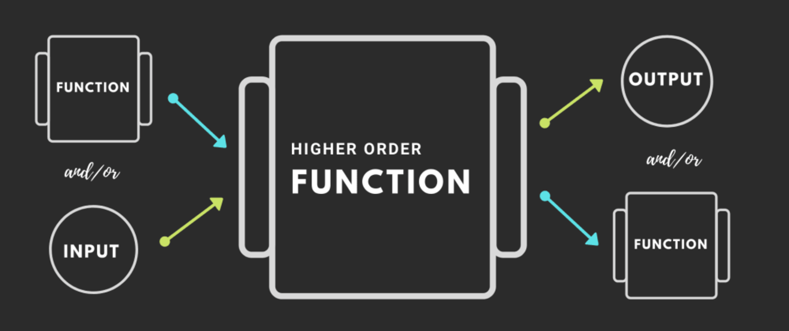

# 🔙 Background





**WHY DO WE EVEN HAVE FUNCTIONS?**

Let’s see why…

**CREATE A FUNCTION 10 SQUARED**

* Takes no input
* Returns 10\*10

**TENSQUARED**

```javascript
function tenSquared() {
  return 10 * 10;
}
tenSquared() // 100
```

**AND A 9 SQUARED FUNCTION? 125 SQUARED?\_**

What principle are we breaking? **DRY (Don’t Repeat Yourself )**

👉 **We can generalize the function to make it reusable.**

```javascript
function squareNum(num) {
  return num * num;
}
squareNum(10); // 100
squareNum(9); // 81
squareNum(8); // 64
```

**GENERALIZING FUNCTIONS**

**Parameters (placeholders)** mean we don’t need to decide what data to run our functionality on until we run the function. We then provide an actual value **(argument)** when we run the function. Higher-order functions follow this same guideline; we might not choose exactly which part of our functionality it is until we run our function.

Now suppose we have a function **copyArrayAndMultiplyBy2**.

```javascript
function copyArrayAndMultiplyBy2(arr) {
  const output = [];
  for (let i = 0; i < arr.length; i++) {
    output.push(arr[i] * 2);
  }
  return output;
}
const myArray = [1, 2, 3];
const result = copyArrayAndMultiplyBy2(myArray)
```

What if you want to copy the array and divide it by 2?

What principle are we breaking? **DRY (Don’t Repeat Yourself )**

👉 We could generalize our function so we pass in our specific instruction only when we run **copyArrayAndManipulate**!

```javascript
function copyArrayAndManipulate(arr, instructions) {
  const output = [];
  for (let i = 0; i < arr.length; i++) {
    output.push(instructions(arr[i]));
  }
  return output;
}
function multiplyBy2(input) {
  return input * 2;
}
const result = copyArrayAndManipulate([1, 2, 3], multiplyBy2);
```

**HOW WAS THIS POSSIBLE?**

<mark style="color:red;">**Functions in JavaScript = first-class objects. **</mark>

In addition to this, let’s highlight some of the other features of functions:

* They can co-exist with and can be handled like other any Javascript object
* Assigned to variables and properties of other objects
* Passed as arguments into functions
* Returned as values from functions

Consider this piece of code

```javascript
function copyArrayAndManipulate(arr, instructions) {
  const output = [];
  for (let i = 0; i < arr.length; i++) {
    output.push(instructions(arr[i]));
  }
  return output;
}
function multiplyBy2(input) {
  return input * 2;
}
const result = copyArrayAndManipulate([1, 2, 3], multiplyBy2);
```


**WHICH IS OUR HIGHER-ORDER FUNCTION ☝?**

The outer function that takes in a function is our higher-order.

**WHICH IS OUR CALLBACK FUNCTION?**

The function we insert is our callback function.

**WHY DO WE NEED TO MASTER THESE TWO CONCEPTS?**

* Callbacks and higher-order functions simplify our code and keep it **DRY**.
* **Declarative readable code:** Map, filter, reduce - the foremost readable way to write code to work with data.
* **Pro interview prep:** One of the most popular topics to check in an interview both for mid/senior-level job interviews.
* **Asynchronous JavaScript:** Callbacks are a central part of **async Javascript**, and are under the hood of **promises**, **async/await**.
