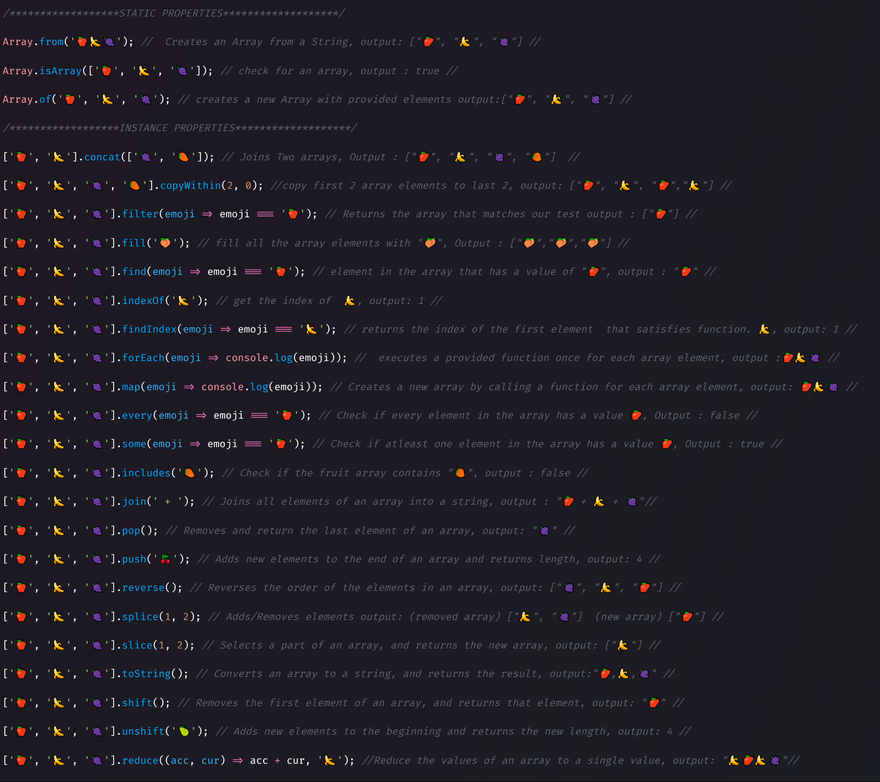

# 📰 Cheat Sheet




## Cheat sheet: JavaScript Array methods

Deriving a new Array from an existing Array:

```
['■','●','▲'].slice(1, 3)          ⟼ ['●','▲']
['■','●','■'].filter(x => x==='■') ⟼ ['■','■']
    ['▲','●'].map(x => x+x)        ⟼ ['▲▲','●●']
    ['▲','●'].flatMap(x => [x,x])  ⟼ ['▲','▲','●','●']
```

Computing a summary of an Array:

```
['■','●','▲'].some(x => x==='●')  ⟼ true
['■','●','▲'].every(x => x==='●') ⟼ false

['■','●','▲'].join('-') ⟼ '■-●-▲'

['■','●'].reduce((result,x) => result+x, '▲')      ⟼ '▲■●'
['■','●'].reduceRight((result,x) => result+x, '▲') ⟼ '▲●■'
```

Changing all of an Array (the input Array is modified and returned):

```
['■','●','▲'].fill('●') ⟼ ['●','●','●']
['■','●','▲'].reverse() ⟼ ['▲','●','■']
['■','●','■'].sort()    ⟼ ['■','■','●']
```

Finding Array elements:

```
['■','●','■'].includes('■')           ⟼ true
['■','●','■'].indexOf('■')            ⟼ 0
['■','●','■'].lastIndexOf('■')        ⟼ 2
['■','●','■'].find(x => x==='■')      ⟼ '■'
['■','●','■'].findIndex(x => x==='■') ⟼ 0
```

Listing elements (spreading via `...` is needed because the methods return iterables):

```
[...['■','●','▲'].keys()]    ⟼ [0,1,2]
[...['■','●','▲'].values()]  ⟼ ['■','●','▲']
[...['■','●','▲'].entries()] ⟼ [[0,'■'],[1,'●'],[2,'▲']]
```

Adding or removing an element at either end of an Array:

```
arr=['■','●'];     arr.push('▲');    arr ⟼ ['■','●','▲']
arr=['■','●','▲']; arr.pop();        arr ⟼ ['■','●']

arr=['■','●'];     arr.unshift('▲'); arr ⟼ ['▲','■','●']
arr=['▲','■','●']; arr.shift();      arr ⟼ ['■','●']
```

